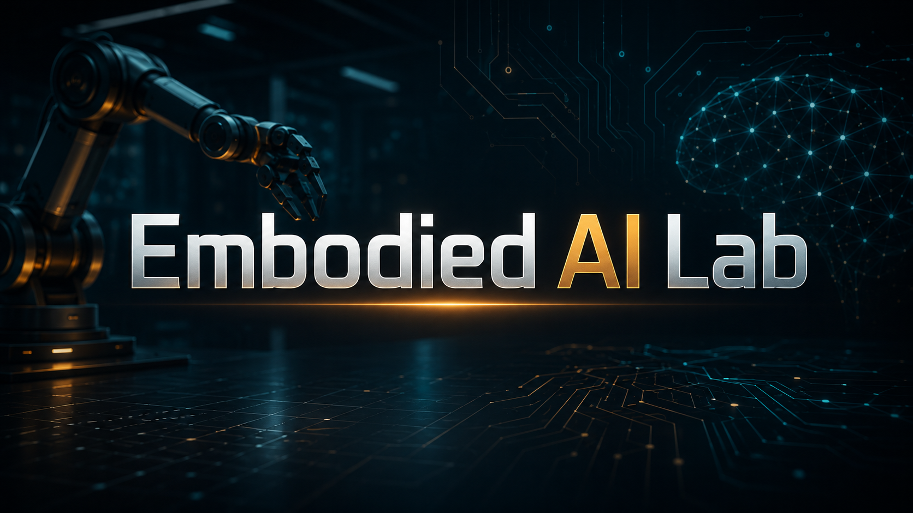

# Embodied AI Lab

English: [README.en.md](./README.en.md)



### 面向具身智能的方向优先、实验驱动课程仓库

Embodied AI Lab 是一个面向学习者和构建者的具身智能课程仓库。它以可运行实验为核心，把感知、导航、控制、学习、操作和系统集成组织成一套从直觉到工程逐步推进的课程地图。

本项目采用 **Python-first, ROS2-ready** 的路线：Level 1 用纯 Python 建立核心算法直觉，Level 2 用 ROS2 / C++ / Mixed Bridge 连接真实机器人软件栈，Level 3 连接研究问题与扩展边界。

本仓库当前采用方向优先的信息架构：研究方向负责顶层导航，实验负责真正的学习闭环与实现落地。

## 这是什么项目

具身智能强调智能体通过物理身体与环境交互，完成从感知、决策到行动的闭环。这使它天然成为一个跨学科领域，连接机器人、控制、计算机视觉、机器学习、几何和系统工程。

这个仓库不是资源清单，也不是纯理论讲义。它的目标是把具身智能拆成可构建、可运行、可观察的课程单元。

## 为什么要做这门课

大多数具身智能资料通常停留在两类形式：

- 告诉你这个领域里有什么
- 默认你已经知道如何把感知、规划、控制和系统代码拼起来

这个仓库采用不同的路线：

- 实验是主要学习单位
- 先跑起来，再抽象
- 可视化和行为结果是解释的一部分
- 高难方向允许先做高质量部分实现，而不是做空洞的全栈演示

## 课程全景

课程围绕 10 个主流研究方向组织。下面的全景表回答三个问题：每个方向在研究什么、学生通常从哪里入门、后续如何进入更强的工程实现。

| 方向 | 核心问题 | 典型 Level 1 入口 | 典型 Level 2 Bridge |
|---|---|---|---|
| 感知 | 机器人如何理解世界？ | 卡尔曼状态估计 | ROS2 perception topics, TF, odometry bridge |
| SLAM 与导航 | 机器人如何知道自己在哪、怎么走？ | Grid Search 路径规划、MCL、EKF-SLAM | ROS2 map/path topics, RViz2, Nav2 concept bridge |
| 运动控制 | 机器人如何稳定、准确地运动？ | PID 与轨迹优化 | ROS2 control loop and trajectory messages |
| 强化学习与模仿学习 | 机器人如何通过奖励或演示习得行为？ | Q-learning、深度强化学习、模仿学习 | policy deployment bridge and action interface |
| 世界模型 | 机器人能否预测未来并用来决策？ | 动力学预测与 rollout | prediction service / planner bridge |
| 视觉语言导航 | 机器人能否理解语言并找到语义目标？ | toy 环境语义搜索 | language goal to ROS2 navigation goal bridge |
| 机器人操作 | 机器人如何与物体交互？ | 运动学、动力学、抓取 | MoveIt2 / trajectory / gripper interface bridge |
| 大模型与机器人 | 大模型如何帮助机器人规划和行动？ | 任务分解与工具调用 | task planning to ROS2 services/actions bridge |
| 仿真与 Sim-to-Real | 如何在仿真中训练并迁移到真实世界？ | 轻量仿真基础 | Gazebo / Isaac / ROS2 simulation bridge |
| 垂直行业应用 | 如何把这些能力落到真实场景？ | 场景化练习 | multi-module ROS2 integration bridge |

## 学习架构

每个方向内部都按三层推进：

- **Level 1: Core Python Lab**  
  当前主产品。纯 Python 实现，无 ROS2 / Gazebo / Isaac / GPU 依赖，可在 Manjaro 或任何标准 Python 环境中直接运行。面向本科生和入门学习者，强调从零实现、可视化、快速反馈和直觉建立。
- **Level 2: ROS2 / C++ / Mixed Bridge**  
  工程桥接层。将 Level 1 的算法直觉接入 ROS2 / C++ / 真实机器人软件栈，面向 Ubuntu 开发环境。强调性能、ROS2 消息/节点、几何约束和实时性。
- **Level 3: Research Extension**  
  研究扩展层。连接课程版本与课题、论文和进一步实现路径。

Python 用来快速建立直觉。  
ROS2 / C++ 用来桥接真实机器人系统。  
研究层用来探索边界与开放问题。

## 研究方向

这一节强调的是“当前仓库里这些方向处于什么状态，以及你该从哪里进入”。

| 方向 | 在本仓库中的角色 | 当前入口 |
|---|---|---|
| 01. 感知 | 提供第一个完整 Level 1 可运行基线。 | 从 `experiments/01-perception/level-1-python` 开始，内含传感器、滤波和基础视觉三组实验。 |
| 02. SLAM 与导航 | 把状态估计扩展到定位、建图与规划闭环。 | 目前以候选实验页为主，建议先从 Grid Search 路径规划进入，再扩展到 MCL 与 EKF-SLAM。 |
| 03. 运动控制 | 提供从感知闭环走向行动闭环的入口。 | 当前以方向页和结构骨架承接 PID 与轨迹方向。 |
| 04. 强化学习与模仿学习 | 在仿真基础成熟后承接策略学习。 | 当前以方向页和骨架为主。 |
| 05. 世界模型 | 面向预测性建模与更强的决策推理。 | 当前是方向入口，后续落地锚点实验。 |
| 06. 视觉语言导航 | 连接语言、语义与导航。 | 当前是方向入口，后续承接语义搜索与 VLN。 |
| 07. 机器人操作 | 从导航转向物体交互与操作能力。 | 当前是方向入口，后续承接运动学、动力学与抓取。 |
| 08. 大模型与机器人 | 探索大模型作为规划层与工具使用层。 | 当前是方向入口，后续承接 task planning agent。 |
| 09. 仿真与 Sim-to-Real | 提供训练环境与迁移能力基础。 | 当前方向与 `04-robot-sim` 的未来迁移关系最紧密。 |
| 10. 垂直行业应用 | 把跨方向能力组合成场景化系统。 | 当前以方向入口和 capstone 规划为主。 |

## 推荐学习路径

### 路径 A：本科生通用入门

1. 感知
2. SLAM 与导航
3. 运动控制
4. 强化学习与模仿学习
5. 机器人操作或仿真与 Sim-to-Real

### 路径 B：控制背景学习者

1. 运动控制
2. 感知
3. SLAM 与导航
4. 机器人操作
5. 仿真与 Sim-to-Real

### 路径 C：计算机视觉 / AI 背景学习者

1. 感知
2. 强化学习与模仿学习
3. 视觉语言导航
4. 大模型与机器人
5. 世界模型

### 路径 D：科研准备

1. 至少完成 3 个 Level 1 方向
2. 把其中 1 个方向桥接到 Level 2
3. 从 Level 3 中选择一个研究出口做课题延伸

## 当前进度

仓库正在从旧的实验平铺结构迁移到方向优先结构。当前状态如下：

- 感知方向 Level 1 已完成传感器仿真、状态估计和基础视觉三组实验
- 多数后续方向仍处于方向页与结构骨架阶段
- 方向优先结构已经建立，代码迁移正在逐步展开

| 区域 | 状态 |
|---|---|
| 方向优先信息架构 | 进行中 |
| 根首页重写 | 已完成 |
| 方向落地页 | 第一批已完成 |
| 感知 Level 1 视觉路线 | 已完成 |
| shared 模块抽取 | 计划中 |
| World Models / VLN / LLM+Robot 锚点实验 | 计划中 |

## 代表性输出

后续会在这里放稳定的课程展示图、动画和对比结果。首批候选包括：

- 卡尔曼滤波对比图
- 规划可视化结果
- 控制跟踪曲线
- 机器人操作场景渲染

## 仓库结构

```text
README.md
README.en.md
shared/
experiments/
docs/
tests/
```

- `shared/` 存放跨方向复用的基础设施与公共说明
- `experiments/` 存放方向页和实验内容
- `docs/` 存放对公开仓库有价值的课程文档
- `tests/` 存放公开仓库本身需要的回归测试

## 快速开始

### Python 路径

感知方向包含传感器基础、卡尔曼滤波和基础视觉三组完整实验。

```bash
cd experiments/01-perception/level-1-python
pip install -r requirements.txt

# 实验 1：传感器基础与噪声建模
python scripts/noise.py        # 噪声类型对比
python scripts/sensors.py      # 多传感器对比
python scripts/fusion.py       # 融合效果

# 实验 2：卡尔曼滤波家族
python scripts/kf.py           # 线性 KF
python scripts/ekf.py          # 扩展卡尔曼滤波
python scripts/ukf.py          # 无迹卡尔曼滤波
python scripts/pf.py           # 粒子滤波
python scripts/all.py          # 四合一对比
python scripts/kf_tuning.py    # 参数实验

# 实验 3：基础视觉
python scripts/camera_calibration.py --generate-board   # 生成棋盘格
python scripts/aruco_pose.py --generate-marker          # 生成 ArUco marker
python scripts/classic_vision.py --generate-sample --mode optical-flow  # 光流样例
```

### ROS2 / C++ 桥接路径

Level 2 将 Level 1 的 Python 算法直觉桥接到 ROS2 / C++ / 真实机器人软件栈。当前建议先完成 Level 1 建立直觉，再从方向页进入 Level 2 工程桥接实验。

> 设备策略：Level 1 在 Manjaro 或任意 Python 环境中运行；Level 2 面向 Ubuntu 开发环境，需要 ROS2 和 C++ 工具链。

## 路线图

### 第一阶段

- 建立方向优先结构
- 建立双语公开入口
- 完成第一批方向页与共享说明
- 明确 Python-first, ROS2-ready 的三层定位

### 第二阶段

- 逐步迁移旧实验文档到方向结构
- 抽取可复用代码到 `shared/`
- 建立 Level 1 → Level 2 的 ROS2 / C++ 桥接接口

### 第三阶段

- 补齐 World Models、视觉语言导航、大模型与机器人三类锚点实验
- 扩展更多双语方向页与实验教程
- 补充正式视觉素材和展示输出
